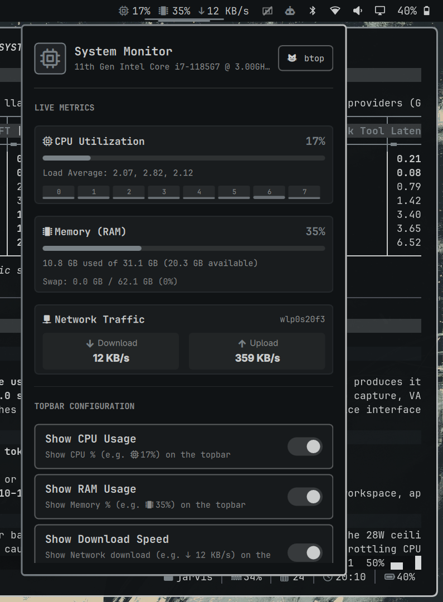

# System Monitor Plugin for Omarchy

A high-performance, native system monitoring plugin and status bar widget for the [Omarchy](https://github.com/omarchy) desktop shell (powered by [Quickshell](https://quickshell.org/)).

Shows live CPU utilization, RAM usage, and Network speed directly on your topbar, complete with a rich popup window providing real-time hardware diagnostics and visual configuration toggles.



---

## ✨ Features

- **Topbar System Status**:
  - **CPU Utilization**: ` <usage>%` (e.g., ` 18%`).
  - **RAM Memory Usage**: ` <usage>%` (e.g., ` 35%`).
  - **Network Download Speed**: `↓ <speed>` (e.g., `↓ 1.2 MB/s`).
  - **Network Upload Speed**: `↑ <speed>` (optional, e.g., `↑ 45 KB/s`).
  - **Dynamic Theme Palette**: Inherits active Omarchy theme foreground, accent, and font colors.
  - **High Load Alert**: Changes metric color to `urgent` (#ef4444) when CPU ≥ 85% or RAM ≥ 90%.
  - **Orientation-Aware**: Responsive layout for horizontal and vertical status bars.
- **Interactive Configuration & Diagnostic Popup**:
  - **System Overview**: Displays CPU model name, system uptime, and a one-click button to open `btop`.
  - **Detailed CPU Card**: Animated progress bar, 1m/5m/15m load averages, and live per-core mini load bars.
  - **Detailed RAM Card**: Animated memory progress bar, used / total GB, free/available GB, and swap usage.
  - **Detailed Network Card**: Active interface detection, live download & upload speed cards.
  - **Visual Configuration Toggles**:
    - Toggle CPU display on the bar on/off.
    - Toggle RAM display on the bar on/off.
    - Toggle Download speed on the bar on/off.
    - Toggle Upload speed on the bar on/off.
    - Toggle Metric icons on the bar on/off.
    - Adjustable refresh interval buttons (1s, 2s, 3s, 5s).
- **Zero-Process Overhead**:
  - Reads directly from Linux `/proc/stat`, `/proc/meminfo`, `/proc/net/dev`, `/proc/loadavg`, and `/proc/uptime` using Quickshell's native C++ `FileView`.
  - No background bash/subshell spawns, guaranteeing ultra-low power consumption and zero system latency.
- **Persistent Preferences**:
  - Saves your preferences to `~/.local/state/omarchy/settings/sys-monitor.json` and syncs with Omarchy's `shell.json`.

---

## 🚀 Installation

### Automated Install

Run the included installation script from this directory:

```bash
./install.sh
```

### Manual Install

1. Link or copy this directory into your Omarchy plugins folder:
   ```bash
   ln -s "$(pwd)" ~/.config/omarchy/plugins/sys-monitor
   ```

2. Validate and rescan the plugin:
   ```bash
   omarchy plugin validate ~/.config/omarchy/plugins/sys-monitor
   omarchy-shell shell rescanPlugins
   ```

3. Enable the plugin:
   ```bash
   omarchy plugin enable sys-monitor
   ```

---

## ⌨️ Controls & Keybindings

| Action | Control | Description |
|---|---|---|
| **Toggle Popup Window** | Left-Click on bar widget | Opens or closes the detailed diagnostic and settings popup |
| **Launch Task Manager** | Right-Click on bar widget | Spawns `btop` in your configured terminal |
| **Force Immediate Refresh** | Middle-Click on bar widget | Forces an instant reload of all system stats |
| **Close Popup** | Escape key / Click outside | Closes the popup window |

### Custom Keyboard Shortcut

To bind a keyboard shortcut in Hyprland to summon or toggle the System Monitor popup:

```hyprlang
# In ~/.config/hypr/hyprland.conf or ~/.config/omarchy/hooks:
bind = SUPER, M, exec, omarchy-shell shell toggle sys-monitor '{}'
```

---

## ⚙️ Bar Position & Layout

You can rearrange the bar widget position using the standard `omarchy bar` command:

```bash
# Move to the center section:
omarchy bar move sys-monitor --section center

# Move next to another widget:
omarchy bar move sys-monitor --section right --after omarchy.tray
```

---

## 📁 Repository Structure

```
.
├── BarWidget.qml        # Main Quickshell bar widget, topbar layout, and popup window
├── SysMonitorModel.js   # Pure JS parsing engine for /proc statistics and speed formatting
├── manifest.json        # Omarchy shell plugin manifest
├── install.sh           # Automated plugin symlink and activation script
└── README.md            # Documentation
```

---

## 📄 License

MIT License. Designed for Omarchy and Arch Linux.
